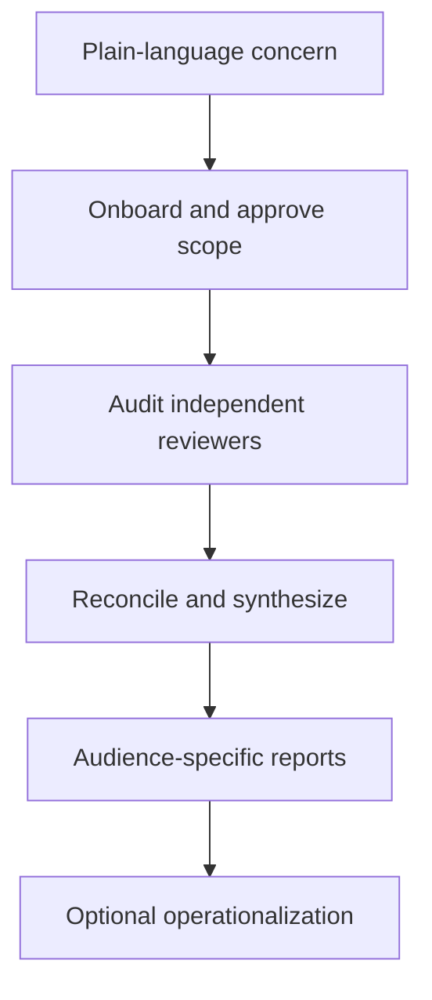

# Whats.Going.On.


**Find out what is true, what is risky, and what needs to happen next.**

When key developers leave, a vendor handoff goes sideways, costs stop making sense, or a product is harder to operate than expected, a repository scan is not enough. Leadership needs to understand the product, the technology, the operating reality, and the business consequences together.

Whats.Going.On. (WGO) is an open-source, prompt-first audit plugin for startups and SMBs. It guides an auditor from a plain-language concern to evidence-backed findings, owned decisions, and reports written for the people who must act on them.

**WGO runs locally with Codex, Claude, or OpenCode. There is no hosted service, database, dashboard, or proprietary scoring model.**

> WGO is not another static analyzer. It is a semi-structured audit lead that helps you ask the right questions, inspect the right evidence, preserve uncertainty, and explain the result clearly.

## When WGO Helps

- Three developers left and nobody knows whether the product can still be deployed or recovered.
- A vendor delivered a large body of work, but its usable value and maintenance cost are unclear.
- Product claims, customer expectations, and implemented behavior may not match.
- Cloud, software, staffing, or support costs need to be understood and controlled.
- Leadership needs a credible view of security, privacy, architecture, scalability, or code quality.
- A founder, buyer, investor, or incoming technical lead needs practical due diligence.
- The next team needs to know what is safe to change, what must be verified, and who must decide.

## What Makes It Different

| WGO principle | What it means in practice |
|---|---|
| Start with the business concern | The audit scope follows the decision leadership needs to make, not a fixed technical checklist. |
| Choose the relevant perspectives | WGO recommends the product, technical, operational, security, continuity, and business perspectives that fit the decision; it explains exclusions and optional additions, then runs coordinator-owned dependency waves. |
| Treat missing evidence as evidence | Inaccessible GitHub, Jira, cloud, billing, or chat sources are reported as limitations, never quietly replaced by weaker proxies. |
| Ask questions that can change the answer | Material gaps become focused stakeholder questions, verifications, or decisions. WGO does not guess intent or interrupt people to fill a template. |
| Reconcile contradictions | Each reviewer surfaces meaningful conflicts, and synthesis reconciles them again across the whole audit. |
| Separate facts from conclusions | Source evidence, observations, approvals, unknowns, and future work remain distinct and linked. |
| Seek decision-useful insights | WGO connects evidence into insights that change a decision, priority, sequence, claim, or stop condition. It does not force a quota of insights. |
| Use complementary perspectives | Reviewers and operator aids address distinct concerns; maintenance handover, recovery, observability, and IAM are not collapsed into one generic runbook. |
| Write for the people doing the work | Business owners, product managers, and technical leads each receive a report shaped around their responsibilities. |

## Five-Minute Start

Clone WGO, then install it into the project you want to audit.

macOS or Linux:

```bash
git clone https://github.com/wgo-audit/code.git whats-going-on
cd whats-going-on
./install.sh /path/to/project
```

Windows:

```bat
git clone https://github.com/wgo-audit/code.git whats-going-on
cd whats-going-on
install.bat C:\path\to\project
```

Open the target project in Codex, Claude, or OpenCode and start onboarding:

```text
# Codex
wgo:onboard

# Claude
/wgo:onboard

# OpenCode
/wgo-onboard
```

The installer creates a native Codex plugin at `plugins/wgo` and a native
Claude plugin at `.claude/skills/wgo-claude`. It renders the same canonical
skill for OpenCode at `.opencode/skills/wgo` and adds thin command wrappers at
`.opencode/commands/wgo-*.md`. All three providers are rendered from the same
canonical skill and command files; provider-specific frontmatter is filtered
from installed copies, so the workflow cannot drift between maintained
implementations.
On first use, accept Claude's workspace-trust prompt; if Claude was already
open during installation, run `/reload-plugins` or reopen the project.
Restart OpenCode after installation. Until OpenCode indexes newly installed
skill files, its command wrappers load `.opencode/skills/wgo/SKILL.md` directly.

For a first audit, WGO confirms the company, product, business concern,
additional evidence, and reviewers. It creates
`_whats-going-on-YYYYMMDD/`, dated when onboarding starts, only after approval.
On a project with a prior audit, WGO displays the stored configuration and asks
only whether anything needs updating. Completed reviewers are synthesized
automatically, and WGO asks before operationalization.

See [what to expect during onboarding](docs/onboarding-expectations.md) for the
question sequence, example answers, and how each answer guides the audit.

Before installing an optional helper, WGO first checks whether it is already
available, then asks separately for CodeGraph, `pdftotext`, Pandoc, and
PyMuPDF4LLM. PyMuPDF4LLM's one consent covers its required Python distribution
from [python.org](https://www.python.org/downloads/) and the package. Declining
or failing any optional installation leaves WGO's built-in fallback in place.

During onboarding, the auditor gives local evidence/documentation folders and
GitHub repositories containing supporting records in one list. WGO clones each
requested accessible GitHub ref into an audit temporary folder, then builds a
compact, searchable catalog together with documentation already present in the
audited repositories; reports still cite the original document and section. A
second lightweight pass flags material references that do not resolve locally
and likely critical documentation not found in the available corpus. WGO shows
the qualified signals and asks whether the auditor wants to add sources before
the audit; they are navigation leads, not automatic findings. If the current
folder is not a Git repository, WGO asks for and clones the primary GitHub code
repository; when that repository is not a monorepo, it also asks for the other
code repositories that support the product.
For every confirmed GitHub code repository, WGO automatically uses accessible
PRs, issues, Projects, Actions, releases, and history without separate consent.

## The Audit Flow

Before starting, read [what to expect during onboarding](docs/onboarding-expectations.md).



1. **Onboard:** establish the product, mandate, evidence boundary, success criteria, and selected reviewers. WGO also discovers project-local reviewer extensions, but never selects one without approval.
2. **Audit:** inspect one reviewer or run all selected reviewers in coordinator-defined dependency waves; register evidence, ask material questions, and update shared controls.
3. **Check status:** see completed work, open proof, access blockers, risks, decisions, and remaining reviewers.
4. **Summarize:** reconcile the whole audit, create decision-grade reports for each audience, and produce a reconciled API-equivalent audit cost estimate.
5. **Operationalize when justified:** after a completed audit, explicitly request draft operator aids. WGO will not execute them or change a system.

Run a named reviewer when you want focused control. With no reviewer argument,
WGO runs all selected reviewers in dependency waves, parallelizing only reviewers
that do not depend on each other.

## Commands

| Purpose | Codex | Claude | OpenCode |
|---|---|---|---|
| Start, improve, or compare an audit | `wgo:onboard` with `[compare\|blind-compare] [YYYYMMDD]` | `/wgo:onboard` with `[compare\|blind-compare] [YYYYMMDD]` | `/wgo-onboard` with `[compare\|blind-compare] [YYYYMMDD]` |
| Run one reviewer or all selected reviewers | `wgo:audit [reviewer-id\|all]` | `/wgo:audit [reviewer-id\|all]` | `/wgo-audit [reviewer-id\|all]` |
| Show truthful progress and blockers | `wgo:status` | `/wgo:status` | `/wgo-status` |
| Reconcile findings and generate reports | `wgo:summarize` | `/wgo:summarize` | `/wgo-summarize` |
| Produce a reconciled API-equivalent audit cost estimate | `wgo:cost` | `/wgo:cost` | `/wgo-cost` |
| Draft operator aids after approved synthesis | `wgo:operationalize` | `/wgo:operationalize` | `/wgo-operationalize` |

The audit always concerns the full project in the current folder, including all
repository subfolders.

## Audit Reviewers

Start with the reviewers that answer the business concern. Each reviewer is independent and can evolve without changing the others.

| Reviewer | Question it helps answer |
|---|---|
| `business-continuity` | Can the company demo, deploy, operate, recover, and transfer control if a person, vendor, account, or environment disappears? |
| `maintenance-cost` | What skill mix, effort, operating burden, and change risk will a small replacement team face? |
| `product-value` | What customer and business value is demonstrably implemented, partial, promised, or still awaiting sign-off? |
| `security-privacy` | What material identity, credential-sharing, exposure, privacy, PII, and operating-control risks exist? |
| `revenue-risk` | What could interrupt demos, sales, pilots, onboarding, renewals, trust, or customer delivery? |
| `expense-exposure` | What actual or potential cash exposure comes from infrastructure, software, staffing, commitments, and failure modes? |
| `contributor-vendor-value` | What usable output, ownership, knowledge, handoff, and cost-relative value did people or vendors provide? |
| `project-health` | Can a small team understand, prioritize, review, accept, release, and learn from the work? |
| `scalability` | Does the product support its realistic business growth envelope across workload, data, operations, third parties, and cost? |
| `code-quality` | Which code-level risks materially affect correctness, delivery, maintainability, security, or product promises? |
| `architecture` | Is the current system, its dependencies, ownership, and important decisions understood well enough for safe change? |

Realignment is not a separate reviewer. When material change is justified by the completed audit, it belongs in the executive summary's 30-90 day plan.

## What You Get

Every completed audit creates a start-here index and reports for three audiences:

| Artifact | Primary reader | What it answers |
|---|---|---|
| `index.md` | Everyone | Where should I start, and what is now, next, evidence-gated, or later? |
| `executive-summary.md` | Business owner | What is the business posture, which decisions need authority now, which evidence is needed, and which corrections should follow? |
| `product-manager-notes.md` | Product manager | What is implemented, promised, valuable, risky to revenue, or in need of product direction? |
| `technical-lead-notes.md` | Technical lead | What is known about implementation, operations, maintainability, security, quality, and safe evolution? |

All audit artifacts live under a dated `_whats-going-on-YYYYMMDD/` root. New
audits begin with a brief, one checklist, reusable evidence ledger,
source-access register, shared open items, reviewer reports and compact
handoffs, selected reviewer-owned artifacts, and the four final reports. The
source project and external systems remain read-only unless the auditor
separately authorizes a change.

### Detailed Control Artifacts

WGO selects only the artifacts that answer a material question. Required or
triggered artifacts are created; a
material omission has one concise explanation and closure route. Untriggered
outputs do not create `not-applicable` paperwork.

Reviewer reports contain decision-useful insights only when evidence changes a
decision, priority, sequence, claim, or stop condition. Synthesis preserves
independent insights, but does not impose a target number.

Reports also identify evidence-supported strengths when they reduce a concern
in the audit mandate. An unexamined area or missing evidence is never presented
as a strength.

Depending on the selected reviewers and evidence, this can include evidence-labelled Mermaid diagrams, critical API/workflow flows, configuration-contract matrices, access and vendor controls, a secret-surface map, and burn, renewal, expiry, or maintenance analysis.

At detailed Architecture or Product Value depth, WGO first mines a coverage-led decision inventory across the relevant decision domains. It can use bounded internal subagents to inspect non-overlapping source slices, then reconciles every candidate as a record, merge, non-decision, block, or deferral. This produces richer ADRs/PDRs without turning a small audit into a document factory.

## From Audit To Safe Operating Aids

An audit should not silently turn into operational work. `wgo:operationalize` is therefore a separate, explicit post-synthesis phase available only when:

1. A synthesis is completed or completed with open verification.
2. The auditor explicitly requests operationalization.
3. Creating local audit artifacts is permitted.

When operationalization completes, WGO refreshes `controls/cost-estimate.md`
through the operator-aid phase. It preserves the earlier audit-only cost
manifest and excludes both cost-calculation passes from the estimate.

It produces a focused four-part operating packet. These are complementary
operating perspectives, not variants of one generic runbook:

- `replacement-maintainer` — bounded acceptance of safe change, delivery correlation, upgrade judgment, and rollback;
- `recovery` — a controlled recovery exercise;
- `observability` — evidence collection, health signals, and escalation boundaries; and
- `iam-and-credential-control` — accountable access, least privilege, rotation, offboarding, and emergency revocation.

Each is a separate draft so a focused procedure does not become an oversized
runbook. They cross-link where a prerequisite belongs to another aid.

Before drafting, WGO names these four required aids and asks whether the
auditor also wants any optional aid: `worker-data-operations`,
`isolated-rebuild`, `network-exposure`, `demo`, `demo-reset`, or `delivery`.
Only the selected optional aids are added.

It never authenticates to systems, deploys, restores, rotates credentials, changes billing, or executes a procedure. Unknown commands, identities, fixtures, thresholds, rollback steps, and owners stay `UNKNOWN`. A draft runbook is documentation, not proof of live operability or recovery readiness.

## Evidence Integrity

WGO deliberately separates:

- implementation in source code;
- hosted PR, issue, and CI metadata;
- current live state;
- observed behavior and readiness;
- ownership and authority;
- cost and commercial impact;
- stakeholder intent and approved decisions.

One does not automatically prove another. Material findings cite exact evidence and state their confidence, cutoff, dimensions, and limitations.

Expected sources that cannot be accessed trigger a visible warning. The auditor must restore access, provide an approved fallback, or accept the exclusion and its consequences. Secret values and unnecessary PII must never be copied into audit artifacts.

When an in-scope source points to relevant material outside the approved
boundary, WGO records the pointer as documented but unverified, explains what
it cannot establish, and identifies the smallest useful verification or scope
expansion. It does not quietly treat the referenced material as reviewed.

## Improve Or Compare An Audit

WGO audit state is local, readable Markdown rather than model-specific memory.
An auditor can begin an audit with Codex, Claude, or OpenCode and later improve
the same dated audit root with either of the other providers. The provider's
plain onboarding command reopens the newest root read-write, displays its
configuration, and asks whether anything needs updating.

Adding `compare [YYYYMMDD]` to the provider's onboarding command creates today's
root and performs a targeted, read-only comparison against the named completed
baseline or the latest completed audit. Adding `blind-compare [YYYYMMDD]`
performs a full audit without exposing baseline findings, then compares the
completed audits. Both comparison modes report reviewer-version differences
and, when versions differ, require the auditor to accept the installed versions
before proceeding.

The result is cumulative, but not blindly append-only:

- an unchanged open item or decision retains its identifier;
- a verified correction, superseded item, or item outside the current scope
  keeps its identifier and receives an explicit disposition;
- a materially changed item gets a new identifier linked to the item it
  supersedes; and
- genuinely new identifiers continue after the highest existing identifier in
  that audit root.

An improve run may revise the current audit. Comparison modes never modify the
baseline.

## Optional: Validate An Audit

The bundled validator is optional. It checks required structure, reviewer and final-report sections, stable-ID formats, core table schemas, controlled states, evidence-cutoff labels, required decision inventories/registers, and obvious credential-like leakage; it does not score risks or make business judgments. WGO uses an existing `python3` or `python` when available, or the Python interpreter installed for approved PyMuPDF4LLM support. If neither exists, the audit continues with a visible structural-validation warning; WGO does not install Python just to run this check.

```bash
python3 skills/wgo/scripts/validate_audit_structure.py \
  /path/to/project/_whats-going-on-YYYYMMDD \
  --require-final
```

For operationalized audits, add `--require-operationalization`:

```bash
python3 skills/wgo/scripts/validate_audit_structure.py \
  /path/to/project/_whats-going-on-YYYYMMDD \
  --require-final \
  --require-operationalization
```

## Extend WGO

WGO is intentionally built from Markdown workflows, templates, independent reviewer definitions, and a small deterministic validator. There is no application framework to learn.

A useful community contribution might:

- improve one reviewer without changing unrelated reviewers;
- add a new reviewer for a distinct business concern;
- sharpen an evidence or reconciliation rule;
- add a provider-specific evidence collection recipe;
- improve report or control templates;
- add validator coverage for a structural invariant.

Core reviewer packages live in
[`skills/wgo/references/reviewers/`](skills/wgo/references/reviewers/).
Project-local extensions live in `plugins/wgo-reviewers/<reviewer-id>/`; they
may add a perspective or replace one core reviewer, but are always optional and
auditor-approved. Each package carries its own metadata, workers, and optional
dependency installer. See
[Building a WGO reviewer](skills/wgo/references/common/reviewer-authoring.md) for the authoring model,
examples, and validation behavior. The
[canonical reviewer contract](skills/wgo/references/common/reviewer-contract.md)
and [internal reviewer blueprint](skills/wgo/references/common/reviewer-blueprint.md)
define the coordinator-facing details.

## Project Philosophy

Small companies deserve rigorous answers without enterprise ceremony.

WGO keeps the jargon under the hood, asks humans only the questions that matter, and refuses to turn missing proof into confident prose. The goal is not to produce the largest audit. It is to leave founders and operators with a trustworthy understanding of what is going on.
