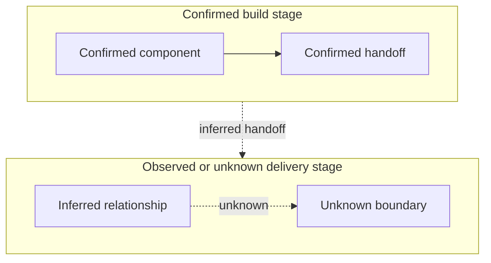

# Selected Artifact Templates

Read a template immediately before producing its selected artifact. Remove
instructional prompts in the completed artifact.

## Evidence-Bounded Assessment Or Control View

```markdown
# <Artifact Title>

Use when: A lens card's conditional trigger is met and a fixed view makes a material reader question clearer.
Reader question: <bounded question>
Create from: Approved source, configuration, authoritative records, and attributed stakeholder evidence.
Do not infer: Current operation, ownership, approval, cost, or effectiveness from source presence alone.
Minimum completion: State evidence boundary; show the material position; link evidence; label unknowns; name a closure route when material.
If unknown: State `unknown` in the relevant row and link an open item only when a future owner, authority, or proof is needed.

## Evidence Boundary

## Evidence Dimensions Used

State which of implementation, history/rationale, observed operation, ownership/approval, cost/commercial, or specialist evidence is present. State `unknown` for a material dimension that was not approved or not obtained.

## Current Source-Bounded Position

## Material Unknowns And Closure Routes
```

## Contributor Value Assessment

```markdown
# Contributor Value Assessment

Use when: Auditable GitHub/Git or approved evidence supports feature-level attribution.
Reader question: Which contributors account for most of the evidenced delivered value, and where are the attribution limits?
Create from: Linked PRs, commits, issues, reviews, tests, debugging, documentation, runbooks, and approved evidence.
Do not infer: Hours worked, employment performance, contractual acceptance, ownership, or feature value from PR count, LoC, commit volume, or account access.
Minimum completion: Group evidence into coherent feature/change units; retain outcome, task magnitude, quality, share, and confidence separately; link every aggregate; include the lifetime and, when history spans more than 12 months, cutoff-anchored annual 80% lists.
If unknown: State `unknown`, exclude unsupported credit from the numeric aggregation, and explain the coverage limit.

## Evidence Boundary And Attribution Rules
- Audit cutoff:
- Included source types:
- Excluded/inaccessible source types:
- Feature grouping rule:
- Attribution rule:

## Feature/Change Units
| Unit | Outcome and value band | Task magnitude | Delivery quality | Credited contributors and share | Evidence | Confidence/limit |
|---|---|---|---|---|---|---|

Use these within-audit value bands only: `critical = 8`, `high = 5`,
`meaningful = 3`, `bounded = 2`, `minor = 1`. Select a band from the evidenced
outcome and task magnitude; the band is an ordering aid, not a universal
productivity score. Allocate its units only to documented material shares.

## Project-Lifetime Top-80% Contributors
| Contributor | Attributed feature-value units | Share of supported total | Material feature/change units | Evidence and confidence |
|---|---:|---:|---|---|

## Cutoff-Anchored 12-Month Periods
### <YYYY-MM-DD> to <YYYY-MM-DD>
| Contributor | Attributed feature-value units | Share of supported period total | Material feature/change units | Evidence and confidence |
|---|---:|---:|---|---|

Repeat only for complete or partial consecutive 12-month periods back to the
project start. State the aggregated long tail and any cross-period allocation
uncertainty.

## Material Unknowns And Closure Routes
```

## Architecture Or Product Candidate Inventory

```markdown
# <Architecture/Product> Decision Candidate Inventory

Use when: Detailed Architecture/Product Value is approved.
Reader question: Which material observed decisions or durable behaviors were found across applicable domains?
Create from: Approved source, configuration, hosted metadata, and attributed stakeholder evidence.
Do not infer: Approval, rationale, or live behavior from implementation alone.
Minimum completion: Cover applicable domains; give every candidate evidence and disposition; link every created record; state source boundary.
If unknown: Label the missing dimension `unknown` and link a verification, question, or decision-needed item when material.

## Coverage Domains
| Domain | Evidence boundary | Candidate count | Limitation/closure |
|---|---|---|---|

## Decision Candidates
| Candidate ID | Decision or durable behavior | Domain | Evidence | Observed/approved status | Disposition | Record or closure |
|---|---|---|---|---|---|---|
```

## ADR Or PDR Register

```markdown
# <Architecture/Product> Decision Register

Use when: A candidate inventory exists.
Reader question: Which records exist and how completely were decision domains covered?
Create from: The candidate inventory and linked records.
Do not infer: That an observed decision was approved.
Minimum completion: Link every created record; identify coverage boundary; summarize domain dispositions.
If unknown: Link the candidate or open item that closes the gap.

## Records
| ID | Statement | Domain | Status | Evidence confidence | Record link |
|---|---|---|---|---|---|

## Coverage And Disposition
| Domain | Candidates | Records | Other dispositions | Limitation |
|---|---|---|---|---|
```

## Architecture Decision Record

```markdown
# ADR-###: <Title>

Use when: A material Architecture candidate is `record-created`.
Reader question: What technical decision or durable behavior exists, and what evidence supports it?
Create from: Candidate evidence, source/configuration, attributed stakeholder evidence, and linked diagrams.
Do not infer: Runtime proof, approval, or rationale from source implementation.
Minimum completion: State the decision; distinguish observed/approval/rationale; link evidence; explain impact and change conditions.
If unknown: Write `unknown` and route material gaps to an open item.

- Status: observed / accepted / proposed / deprecated / superseded / unknown
- Evidence cutoff:

## Decision Statement
## Observed Position, Rationale, And Approval
| Dimension | Position | Evidence | Limitation |
|---|---|---|---|
| Implementation | | | |
| Runtime/live state | | | |
| Rationale | | | |
| Approval | | | |
## Constraints, Options, And Tradeoffs
## Impacts And Boundaries
## Change, Reversal, And Follow-Up
```

## Product Decision Record

```markdown
# PDR-###: <Title>

Use when: A material Product Value candidate is `record-created`.
Reader question: What product decision or durable behavior exists, and what evidence supports it?
Create from: Candidate evidence, workflow/configuration/output sources, and attributed stakeholder evidence.
Do not infer: Customer acceptance, specialist sign-off, or live behavior from an implemented endpoint.
Minimum completion: State the decision; distinguish behavior/implementation/approval; link evidence; explain product impact and change conditions.
If unknown: Write `unknown` and route material gaps to an open item.

- Status: observed / accepted / proposed / deprecated / superseded / unknown
- Evidence cutoff:

## Decision Statement
## Observed Position, Rationale, And Approval
| Dimension | Position | Evidence | Limitation |
|---|---|---|---|
| Product behavior/promise | | | |
| Implementation | | | |
| Runtime/demonstration | | | |
| Approval/specialist sign-off | | | |
## Constraints, Options, And Tradeoffs
## Impacts And Boundaries
## Change, Reversal, And Follow-Up
```

## Evidence-Labelled Diagram

````markdown
# <Diagram Title>

Use when: Source/configuration evidence answers a material reader question more clearly as a view.
Reader question: <bounded question>
Create from: Approved source and configuration evidence; live observations when available.
Do not infer: Live operation or an unobserved edge.
Minimum completion: State evidence cutoff; legend for confirmed/inferred/unknown; link evidence; state gaps.
If unknown: Draw the edge/node as unknown and link its closure route.

## Purpose And Evidence Boundary
- Reader question:
- Evidence cutoff:
- Confirmed notation:
- Inferred notation:
- Unknown notation:
- Evidence links:

## Evidence Dimensions Used

State which of implementation, history/rationale, observed operation, ownership/approval, cost/commercial, or specialist evidence supports the view.

## Diagram
For a horizontally arranged flow, use a top-to-bottom outer graph with compact
left-to-right stage subgraphs and connect the stage boundaries. If exact
cross-stage node links are material, use a plain top-to-bottom graph instead.
Do not use a bare `flowchart LR` or `useMaxWidth: false`.



## Known Gaps And Follow-Up
````
